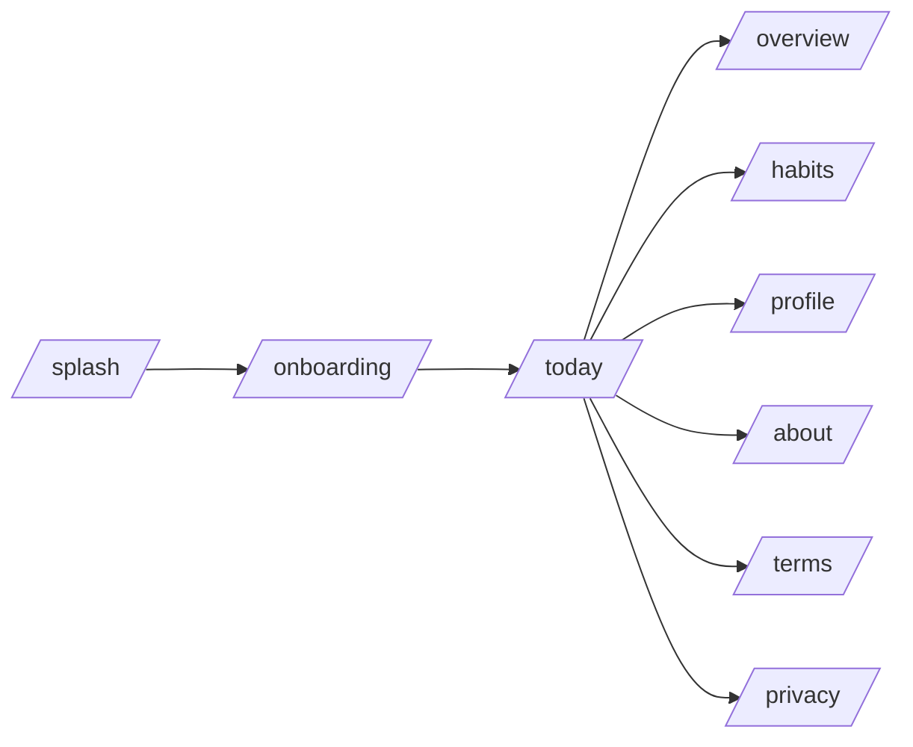
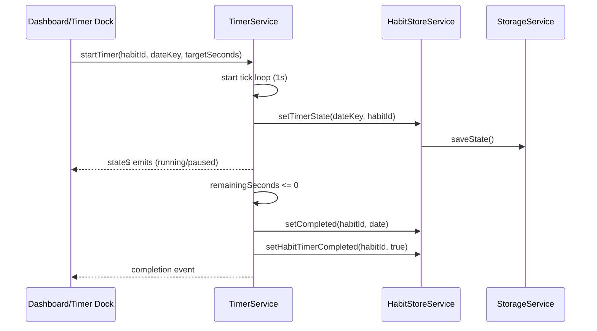
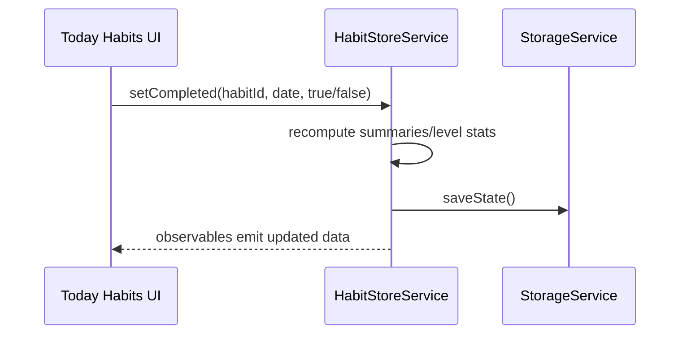

# Architecture

## High-level structure
- `src/app/pages`: route-level screens (Today, Overview, Habits, Profile, etc.)
- `src/app/services`: app state, storage, timers, notifications, export/import
- `src/app/models`: data model types
- `src/app/components` and `src/app/shared`: reusable UI components
- `android/`: native Android project (Capacitor)

## Routing + major pages
Routes are defined in `src/app/app.routes.ts`:
- `/splash`, `/onboarding`, `/getting-started`
- `/today` (Dashboard)
- `/overview`
- `/habits`
- `/profile`
- `/about`, `/terms`, `/privacy`

## Services layer
Core services:
- `HabitStoreService` (source of truth for habits/completions/skips/stats)
- `StorageService` (IndexedDB + localStorage persistence)
- `TimerService` (timer state + completion events)
- `NotificationService` (local notifications via Capacitor)
- `SettingsService`, `ThemeService`, `ProfileService` (user prefs)
- `BackupService`, `ShareService`

## Data storage layer
Primary persistence is IndexedDB (`idb`) with localStorage fallback. See `docs/DATA_MODEL.md` for schema and storage keys.

## State management
The app uses RxJS `BehaviorSubject` and `Observable` streams inside services. Components subscribe and react to updates.

## Diagrams

### App navigation

### Timer workflow

### Habit completion workflow

